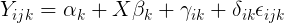
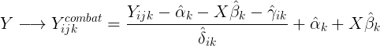
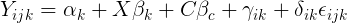
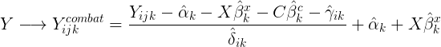

# pycombat

Python version of data harmonisation techinque COMBAT. This package also allows for covariate effects to be removed from the data in addition to batch effects.

Combat is a technique for data harmonisation based on a linear mixed model in which location and scale random effects across batches are adjusted using a bayesian approach (Johnson, 2007):

Original Combat tecnique allowed to keep the baseline effects alpha and the effects of interest beta by reintroducing these after harmonisation:

One extension of this python package is the possibility of removing unwanted variables' effect by no reintroducing them again. Using the same linear mixed model of the begining, we now separate the sources of covariation *C* from sources of effects of interest *X*:

And then in this case, combat adjustment will be given by:

Such an easy and straightforward modification to combat has been recently proposed and introduced by some authors (Wachinger, 2020).

*References*:

- W. Evan Johnson, Cheng Li, Ariel Rabinovic, Adjusting batch effects in microarray expression data using empirical Bayes methods, Biostatistics, Volume 8, Issue 1, January 2007, Pages 118–127, https://doi.org/10.1093/biostatistics/kxj037

- L. Dyrskjot, M. Kruhoffer, T. Thykjaer, N. Marcussen, J. L. Jensen,K. Moller, and T. F. Orntoft. Gene expression in the urinary bladder: acommon carcinoma in situ gene expression signature exists disregardinghistopathological classification.Cancer Res., 64:4040–4048, Jun 2004.

- Christian Wachinger, Anna Rieckmann, Sebastian Pölsterl. Detect and Correct Bias in Multi-Site Neuroimaging Datasets. arXiv:2002.05049

- Fortin, J. P., N. Cullen, Y. I. Sheline, W. D. Taylor, I. Aselcioglu, P. A. Cook, P. Adams, C. Cooper, M. Fava, P. J. McGrath, M. McInnis, M. L. Phillips, M. H. Trivedi, M. M. Weissman and R. T. Shinohara (2017). "Harmonization of cortical thickness measurements across scanners and sites." Neuroimage 167: 104-120.

# Install

    pip install pycombat

# Usage

Following the spirit of scikit-learn, Combat is a class that includes a method called **fit**, which finds the fitted values of the linear mixed model, and **transform**, a method that used the previously learning paramters to adjust the data. There is also a method called **fit_transform**, which concatenates both methods.

So, the first thing that you need to do is to define a instance of this class:

    combat = Combat()

At the time of defining the combat instance, you can pass it the folowing parameters:

  - method: which is either "p" for paramteric or "np" for non-parametric (not implemented yet!!)
  - conv: the criterion to decide when to stop the EB optimization step (default value = 0.0001)

Now, you have to call the method **fit**, passsing it the data.

    combat.fit(Y=Y, b=b, X=X, C=C)

 These input data consist of the following ingredients:

  - Y: The matrix of response variables, with dimensions [observations x features]
  - b: The array of batch label for each observation. In principle these could be labelled as numbers or strings.
  - X: The matrix of effects of interest to keep, with dimensions [observations x features_interest]
  - C: The matrix of covariates to remove, with dimensions [observations x features_covariates]

***Important:***  If you have effects of interest or covariates that involve categorical features, make sure that you drop the first level of these categories when building the independent matrices, otherwise they would be singular. You can easily accomplished this using pandas and **pd.get_dummies** with the option *drop_first* checked.

After fitting the data, you can adjust it by calling the **transform** method:

    Y_adjusted = combat.transform(Y=Y, b=b, X=X, C=C)

Alternatively, you can combine both steps by just calling the method **fit_transform**:

    Y_adjusted = combat.fit_trasnform(Y=Y, b=b, X=X, C=C)
